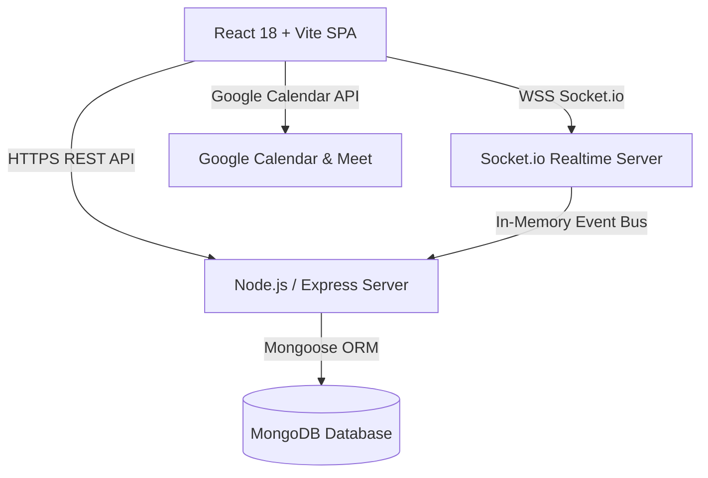

# 🎨 SkillSwap — Architecture & Design System Specification (`design.md`)

> **Version**: 2.0.0  
> **Status**: Active / Production Architecture Specification  
> **Target Stack**: React 18, Vite, Node.js Express, MongoDB, Socket.io, TailwindCSS, Framer Motion  

---

## 1. 🌟 System Overview & Platform Philosophy

**SkillSwap** is a reciprocal peer-to-peer knowledge sharing and time-banking platform. The central premise eliminates monetary exchange in favor of a 1-to-1 **Time Credit System**:
- **1 Hour Taught = +1.0 Time Credit Earned**
- **1 Hour Learned = -1.0 Time Credit Transferred**
- **Starter Incentive**: New users are granted **+2.0 Time Credits** upon completing onboarding.

```
       ┌────────────────┐
       │   User Signup  │ ──► Grants +2.0 Free Initial Time Credits
       └───────┬────────┘
               │
               ▼
┌──────────────────────────────┐        ┌──────────────────────────────┐
│     User A (Offers UX)       │ ◄────► │    User B (Offers React)     │
│    (Wants React Coding)      │        │      (Wants UX Design)       │
└──────────────┬───────────────┘        └──────────────┬───────────────┘
               │                                       │
               ├───────────────────┬───────────────────┤
               ▼                   ▼                   ▼
      ┌─────────────────┐ ┌────────────────┐ ┌──────────────────┐
      │ Reciprocal Match│ │ Google Meet    │ │ Dual Confirmation│
      │ Engine (95%)    │ │ Session (1 Hr) │ │ & Credit Transfer│
      └─────────────────┘ └────────────────┘ └──────────────────┘
                                                       │
                                                       ▼
                                             ┌──────────────────┐
                                             │ 5-Criterion Peer │
                                             │ Rating & Trust   │
                                             └──────────────────┘
```

---

## 2. 💎 Design System & Aesthetic Foundations

SkillSwap adopts a **Liquid Glassmorphism** design language built on HSL-tailored dark modes, specular ambient highlights, and fluid Framer Motion micro-interactions.

### 🎨 Color Palette Tokens

```css
:root {
  /* Surface & Background Tokens */
  --bg-deep-space: #07090e;
  --bg-glass-card: rgba(15, 23, 42, 0.65);
  --bg-glass-card-hover: rgba(30, 41, 59, 0.75);

  /* Primary Brand Gradients */
  --accent-cyan: #06b6d4;
  --accent-violet: #8b5cf6;
  --accent-pink: #ec4899;
  --accent-emerald: #10b981;
  --accent-amber: #f59e0b;

  /* Specular Glow Borders */
  --border-glass: rgba(255, 255, 255, 0.08);
  --border-glass-glow: rgba(6, 182, 212, 0.35);

  /* Typography Colors */
  --text-primary: #f8fafc;
  --text-secondary: #94a3b8;
  --text-muted: #64748b;
}
```

### ⚡ Aesthetic Principles
1. **Frosted Depth & Backdrop Blur**: All navigation panels, modals, and cards leverage `backdrop-blur-xl` combined with multi-layered specular borders.
2. **Ambient Particle Canvas**: An active `AmbientBackground` component renders dynamic floating light orbs moving gracefully across a dark mesh canvas.
3. **Interactive Visual Feedback**:
   - Cards tilt slightly and cast radial glow gradients on hover.
   - Buttons respond with micro-scale animations (`whileHover={{ scale: 1.02 }}`, `whileTap={{ scale: 0.98 }}`).
4. **Typography Hierarchy**: Uses clean modern typography (`Inter`, `Outfit`, `Space Grotesk`) with gradient clip headers (`bg-clip-text text-transparent bg-gradient-to-r`).

---

## 3. 🏗️ High-Level System Architecture

SkillSwap uses a modern full-stack decoupled workspace topology:



### Key Components

- **Frontend SPA (`apps/web`)**:
  - Built with React 18, Vite, Framer Motion, TailwindCSS, and Lucide Icons.
  - State managed via React Context (`AuthContext`, `SocketContext`).
- **Backend API (`server`)**:
  - Express.js handling REST API routes with JWT authentication middleware.
  - Custom calculation modules: `trustScoreCalculator.js`, `matchingService.js`.
- **Real-Time Gateway (`server/sockets`)**:
  - Socket.io broker managing online user status, instant messaging, and live session updates.

---

## 4. 🗄️ Database Schemas & Data Models

### 👤 User Model (`User.js`)
```javascript
{
  name: String,
  email: { type: String, unique: true },
  password: String, // Bcrypt hashed
  bio: String,
  avatar: String,
  timeCredits: { type: Number, default: 2.0 },
  trustScore: { type: Number, default: 85.0 }, // 0 to 100%
  completedSwapsCount: { type: Number, default: 0 },
  hoursTaught: { type: Number, default: 0.0 },
  hoursLearned: { type: Number, default: 0.0 },
  location: { city: String, country: String, coordinates: [Number] },
  isVerified: { type: Boolean, default: false }
}
```

### 🧠 UserSkill Model (`UserSkill.js`)
```javascript
{
  userId: ObjectId,
  skillId: ObjectId,
  type: { type: String, enum: ['TEACH', 'LEARN'] },
  proficiencyLevel: { type: String, enum: ['BEGINNER', 'INTERMEDIATE', 'ADVANCED', 'EXPERT'] },
  yearsExperience: Number
}
```

### 🤝 Session Model (`Session.js`)
```javascript
{
  requesterId: ObjectId, // Student
  mentorId: ObjectId,    // Teacher
  skillId: ObjectId,
  status: { 
    type: String, 
    enum: ['PENDING', 'ACCEPTED', 'DECLINED', 'COMPLETED', 'CANCELLED'],
    default: 'PENDING'
  },
  scheduledTime: Date,
  durationMinutes: { type: Number, default: 60 },
  googleMeetUrl: String,
  creditsTransferred: { type: Number, default: 1.0 },
  requesterConfirmed: { type: Boolean, default: false },
  mentorConfirmed: { type: Boolean, default: false },
  createdAt: Date
}
```

### 🌟 Review Model (`Review.js`)
```javascript
{
  sessionId: ObjectId,
  reviewerId: ObjectId,
  revieweeId: ObjectId,
  ratings: {
    clarity: { type: Number, min: 1, max: 5 },       // 💡 Explanation & Clarity
    methodology: { type: Number, min: 1, max: 5 },   // 🎓 Teaching Methodology
    communication: { type: Number, min: 1, max: 5 }, // 💬 Communication Skill
    respect: { type: Number, min: 1, max: 5 },       // ⭐ Behavior & Respect
    punctuality: { type: Number, min: 1, max: 5 }    // ⏰ Punctuality & Reliability
  },
  averageRating: Number,
  comment: String,
  createdAt: Date
}
```

---

## 5. ⚙️ Core Engine Mechanics

### 1. ⏱️ Time Credit Banking Protocol
- **Signup Bonus**: Automatically sets `timeCredits: 2.0` on registration.
- **Credit Lock**: When a user creates a swap request, the system checks `user.timeCredits >= 1.0`.
- **Dual Completion Transfer**:
  - Both requester and mentor click **"Confirm Completion"**.
  - `requester.timeCredits -= 1.0`
  - `mentor.timeCredits += 1.0`
  - `CreditTransaction` log created with status `SUCCESS`.

### 2. 🎯 Smart Reciprocal Matching Engine
Matches are calculated using a multi-factor weighted scoring algorithm:

$$\text{Match Score} = (W_1 \times S_{\text{skills}}) + (W_2 \times S_{\text{trust}}) + (W_3 \times S_{\text{location}})$$

- **Skill Compatibility (60%)**: Direct match between User A's `TEACH` skills & User B's `LEARN` skills, and vice versa.
- **Trust Score Alignment (25%)**: Higher weight given to top-rated mentors.
- **Geographic Proximity (15%)**: Optional boost if both users share location preferences.

### 3. 🌟 5-Criterion Trust Engine
After session completion, peers rate each other across 5 core metrics. The **Trust Score (0-100%)** is dynamically computed via:

$$\text{Trust Score} = \left( \frac{\sum \text{Peer Average Ratings}}{5 \times N} \right) \times 100\%$$

Badges are dynamically awarded:
- **Top Mentor**: Trust Score $\ge 95\%$ and $\ge 10$ sessions.
- **Verified Pro**: Verified credentials & high rating.

---

## 6. 📱 UX & Navigation Architecture

### 🧭 Primary Navigation (`GlassDockNavbar.jsx`)
Floating frosted-glass navigation dock at the screen base featuring quick action routes:
1. 🏠 **Dashboard (`/dashboard`)**: Overview of credits, upcoming sessions, and quick stats.
2. 🔍 **Discover (`/discover`)**: Search mentors, filter by skill category, proficiency, and trust badges.
3. 🎯 **Matches (`/matches`)**: View reciprocal peer matches sorted by compatibility percentage.
4. 📥 **Requests (`/requests`)**: Manage incoming, sent, and active swap requests with clear filter tabs.
5. 💬 **Chat (`/chat`)**: Direct real-time 1-on-1 messaging with live typing indicators.
6. 🏆 **Leaderboard (`/leaderboard`)**: Rankings of top mentors in the community.
7. 👤 **Profile (`/profile`)**: Manage personal bio, teaching skills, and learning goals.

### 🖼️ Core Interactive Modals
- **SwapRequestModal**: Schedule session date/time, add personal note, select skill to learn.
- **PeerRatingModal**: 5-star interactive rating UI across all 5 dimensions with optional text review.
- **OnboardingWizard**: Multi-step wizard collecting initial teaching skills, learning goals, and location.
- **CmdKModal**: Global quick command palette (`Ctrl+K` / `Cmd+K`) for fast app-wide navigation.

---

## 7. 🔒 Security & Performance Guidelines

1. **Authentication**: Stateful JWT stored securely in standard authorization headers.
2. **Input Validation**: Mongoose schema sanitization and express middleware validation.
3. **Real-time Safeguards**: Socket.io event authentication checking JWT handshake tokens.
4. **Performance**: Optimized database indexing on `UserSkill.userId`, `Session.requesterId`, and `Session.mentorId`.

---

*SkillSwap Architecture Specification — Maintained by Antigravity AI & SkillSwap Engineering Team.*
